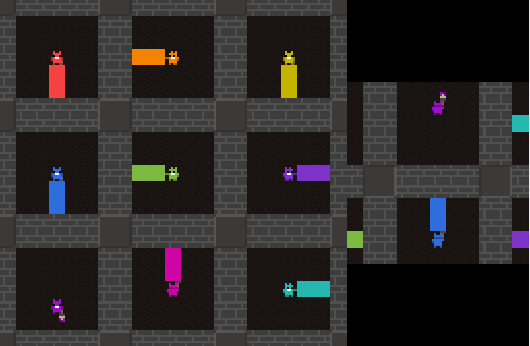

# Melting Pot 2023 Competition Submission - Team Marlshmallows

This repository contains my submission for the Melting Pot 2023 Competition and all necessary code to evaluate it. Detailed information about my solution strategy can be found in the document [Team Marlshmallows Melting Pot 2023 Solution.pdf](Team%20Marlshmallows%20Melting%20Pot%202023%20Solution.pdf).

## Setup Guide

It's recommended to use Ubuntu 20.04. macOS users might run into installation errors. Follow these steps to set up the environment:

### Create Conda Environment

1. Install [Miniconda](https://docs.anaconda.com/miniconda/miniconda-install/)
2. Create a Conda environment with Python 3.10: `conda create -n marlshmallows_env python=3.10.12`
3. Activate the newly created environment: `conda activate marlshmallows_env`

### Install Necessary Packages

1. Install system dependencies by running:

   ```
   sudo apt update
   sudo apt install -y build-essential
   ```

2. Navigate to the project directory: `cd path/to/meltingpot-2023-solution`
3. Make the installation script executable: `chmod +x install.sh`
4. Run the installation script: `./install.sh`

## Evaluate Policies

To evaluate the policies:

1. Open `evaluate.py` and adjust the user settings at the top of the file.
2. Run the evaluation script: `python evaluate.py`

You should see a window appear like below. The left image is the entire world, and the right image is the observation of one of the focal agents. Press space to step through the episode. Press q to end the episode.


